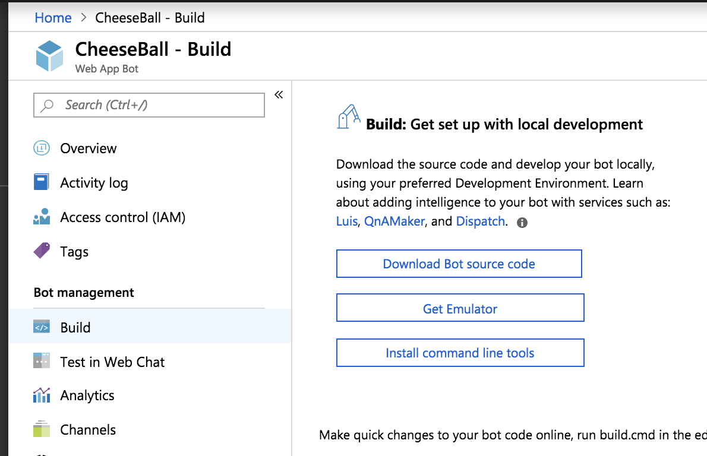
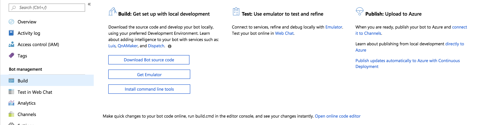
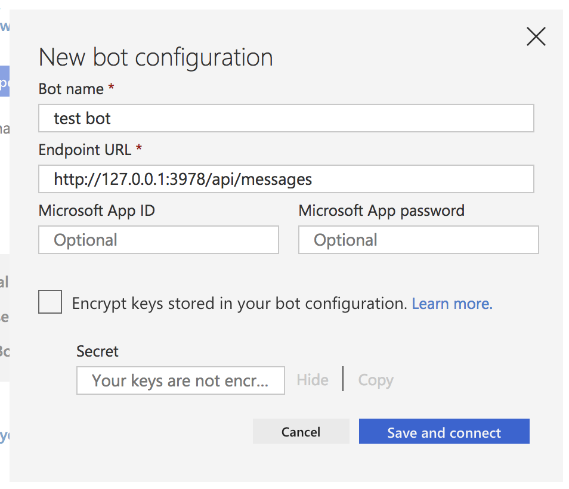

# Creating Chatbot with Bot Framework and Bot Service 

## Environment 
- Mac OS 
- Bot Builder SDK V3  
  - [Update] [V4 stable release](https://github.com/Microsoft/BotBuilder)가 나옴.

## Prerequisites 
- [Visual Studio 2017](https://visualstudio.microsoft.com/ko/downloads/)
  - Extensions : Bot Builder Template for Visual Studio 
  - 안타깝게도 Mac에서는 안되는 것 같다... 
    - 이러한 오픈 소스도 있음. [botframework-template-vs-for-mac](https://github.com/User1m/botframework-template-vs-for-mac)
- Azure Account
- [BotFramework Emulator](https://github.com/Microsoft/BotFramework-Emulator/releases)  

## Language support
- C# and Node. 이 글에서는 C#으로. 

## Web App Bot
- Bot Framework + Azure Storage => Bot Service 를 통틀어.
- 다양한 매신저 Channel들 지원: Skype, Telegram, Slack, Facebook... 

## Steps to build the bot
### 1) ADD Resource Group
- Resource Group 이름은 내 계정 안에서만 Unique 
### 2) 생성한 Resource Group에서 Web App Bot 생성(create)
- Pricing tier
  - F0 : Free
  - S1 : Standard
### 3) Visual Studio 에서 Project 생성
1. Botbuilder 이용 - [Download V3](https://github.com/Microsoft/BotBuilder-V3/releases/tag/3.19.0.44051_BotBuilder-V3-DotNet?fbclid=IwAR0rW8Jxkj-esP3bLRFJavHiiF-wm2GlsyigDjIHrcL0zMVTHwXAHkrq_Nw) 
  - download `.zip` file -> unzip -> CSharp -> `.sln` 파일 더블 클릭
2. Azure Portal > 봇 > Build > download bot source code 하여 폴더 내 `.sln` 파일 더블 클릭

  - `MessageReceivedAsync` 메서드 : 실제 대화를 처리하는 부분
  - 상단 실행 버튼을 통해 실행 > `http://localhost:3984`
  
3. Azure CLI로 코드 다운로드 
  - 위 2 방법을 CLI로 
  ```
  $ az bot download --name "my-bot-name" --resource-group "my-resource-group"
  ```
### 3-1) Online Editor 이용
- Bot Web App > Build > 아래 'Open online code editor'를 통해 코드 수정 후 바로 git commit/push를 통해 수정 가능 

### 4) Emulator에서 테스트 
- New Bot Configuration 을 통해 설정 
 
### 5) 게시(Publish)
- Window 환경에서는 Visual Studio에서 우클릭을 통해 바로 publish 가능한 것으로 보이나 Mac Community 버전에서는 보이지 않음. ([Professional로 하면 보이는 것 같음](https://stackoverflow.com/questions/44750522/publish-to-azure-in-visual-studio-community-for-mac))
  - 대신 [Azure CLI](https://docs.microsoft.com/en-us/azure/bot-service/bot-builder-tools-az-cli?view=azure-bot-service-3.0#7-publish-to-azure-from-the-cli)를 이용해 publish. (처음 azure cli 쓴다면 [이 노트](./azure_cli.md) 참고)
  ```
  $ az bot publish --name "my-bot-name" --resource-group "my-resource-group" // 처음 배포 경우 
  $ az bot update --name "my-bot-name" --resource-group "my-resource-group" // 이미 만들어진 앱인 경우 
  ```
### 6) Azure Portal 에서 확인
- Test in Web Chat 에서 로컬과 같이 동작하는지 확인 
  - how to debug : https://stackoverflow.com/questions/47912543/how-to-find-bots-conversationid-when-testing-in-azure-portal-webchat-console 

## Deploy 
- Continuous Delivery using Github : https://docs.microsoft.com/en-us/azure/bot-service/bot-service-build-continuous-deployment?view=azure-bot-service-4.0 

## Troubleshooting 
### error 502 on 'Test in Web Chat'
- you have to manage a custom state now, you can't just use Microsoft temporary state it's only good for local testing.
- https://stackoverflow.com/questions/52006682/bot-throwing-502-bad-gateway-on-test 

## Sample Apps
- [mycheesebot](https://github.com/jiyeonseo/mycheesebot) - nodejs 

## More resources 
- Azure Dev Doc(SDK 4.x) : https://docs.microsoft.com/en-us/azure/bot-service/?view=azure-bot-service-4.0 
